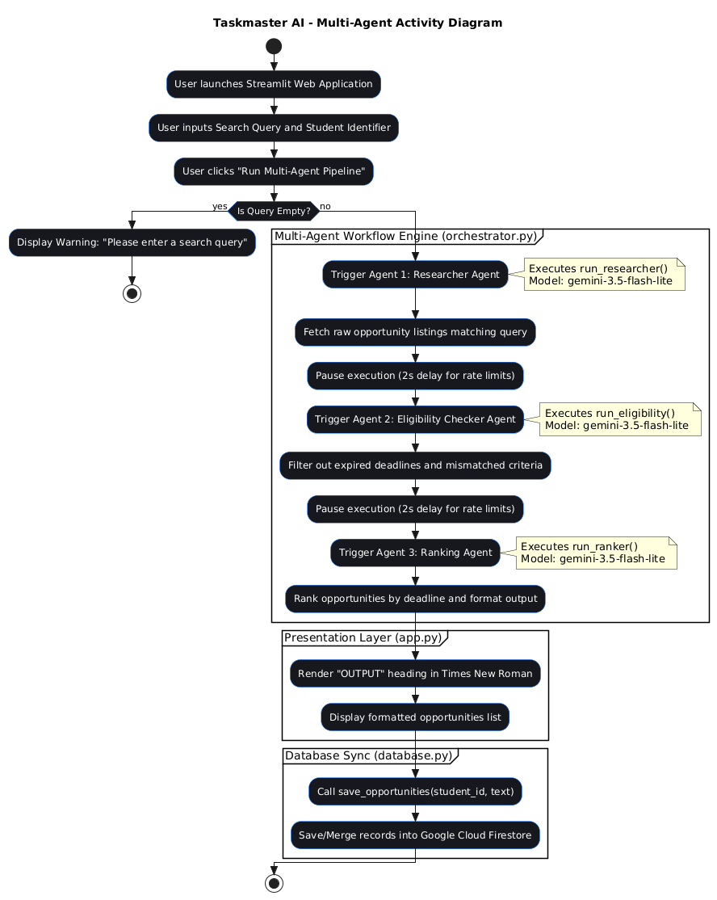

# Taskmaster: Multi-Agent AI Opportunity Scout

Taskmaster is an autonomous multi-agent AI system built for the **All Things Agentic Hackathon 2026**. It automates research, eligibility validation, and deadline ranking for student internships, hackathons, and scholarships.

---

## Key Features
> Sequential Multi-Agent Architecture**: Divides scraping, filtering, and formatting across distinct agentic steps.
> Autonomous Filtering**: Automatically removes expired postings, mismatched prerequisite criteria, and invalid listings.
> Interactive Dashboard**: A sleek dark-mode interface built with Streamlit.
> Persistence Layer**: Seamlessly syncs verified student records to Google Cloud Firestore.

##Activity Diagram

### Agents Breakdown
1. Researcher Agent (`research_agent.py`)**: Gathers raw opportunity listings matching the user prompt.
2. Eligibility Checker (`eligibility_agent.py`)**: Validates degree levels, experience requirements, and submission windows.
3. Ranking Agent (`ranking_agent.py`)**: Sorts opportunities by urgency and formats verified direct links.

---

## 🛠️ Tech Stack
* **Language**: Python 3.10+
* **AI Framework & SDK**: Google GenAI SDK (`gemini-3.5-flash-lite`)
* **Frontend**: Streamlit
* **Database**: Google Cloud Firestore
* **Environment Management**: `python-dotenv`

---

## 📦 Local Setup Instructions

### 1. Clone the Repository
git clone [https://github.com/amanbasor/Internship-hackathon-Finder-Taskmaster.git](https://github.com/amanbasor/Internship-hackathon-Finder-Taskmaster.git)
cd Internship-hackathon-Finder-Taskmaster

2. Set Up Virtual Environment  
# Windows
python -m venv venv
.\venv\Scripts\activate

# macOS/Linux
python3 -m venv venv
source venv/bin/activate

3. Install Dependencies  
pip install -r requirements.txt

4. Configure Environment Variables
Create a .env file in the root directory:
GEMINI_API_KEY="your_google_ai_studio_api_key_here"
PROJECT_ID="your_gcp_project_id"

5. Run the Application
streamlit run app.py

Demo Video
Watch the 1-minute 50-second walkthrough video on YouTube:

>> https://youtu.be/5coT0p44ZQw

Author
Developed by Aman for the All Things Agentic Hackathon 2026.
